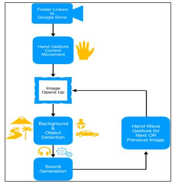
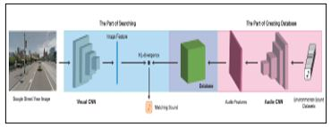

# Sound_generation-_of_image
generating sound of image by finding the background features. 

The main idea of the model is to develop a mechanism which analyses an image on some pre-decided parameters and give out sounds based on the surrounding appearing in that image so that a person can relive that memory, or feel the real presence of that image. 
The model was able to delineate the intended results. It was able to correctly produce the desired sounds based on the objects and surroundings present in an image. For the testing purpose, various pictures of different backgrounds like the beach, stadium, underwater were used and the results were great. This model can be considered as a great alternative to the present baseline methods in this field.

Architecture:

